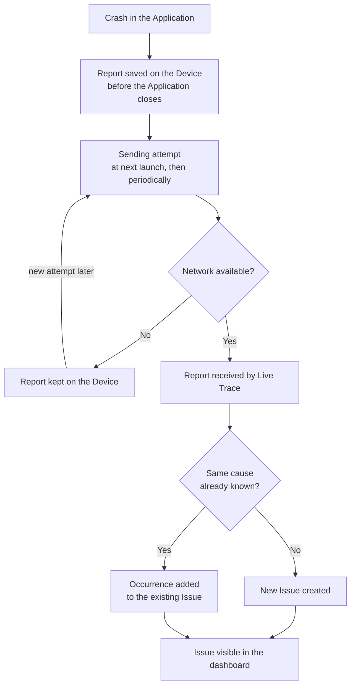
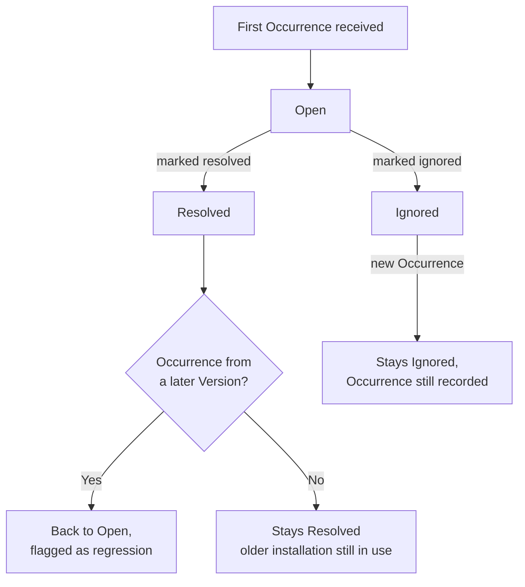

# Functional Analysis — Crash Reporting and Usage Tracking

**Application:** Live Trace | **Status:** Proposal, pending business validation | **Date:** 29/09/2026

## 1. Context and problem

The company runs several internal MAUI applications (Android tablets on 4G and Windows workstations, around a hundred users a day). When one of them crashes, the team learns about it only when a user complains, with no technical trace and no context: diagnosis relies on reproducing the problem blindly. Market tools (Sentry, Raygun, App Center) are excluded by an internal rule: this tool must not depend on an external project, even self-hosted.

**Today, nobody knows how often an application crashes, on which version, because of which error, or which user was affected.**

## 2. Objective

Live Trace gives the team the guarantee that **every crash of a tracked application is captured, kept and made visible**, even when the device has no network at the time of the crash. Crashes are **grouped by root cause** so the team reads ten problems instead of a thousand reports, each problem carries **enough context to be diagnosed without reproducing it**, and the team knows **which users were affected** so they can contact them.

## 3. How it works

- A **Live Trace module** is built into each tracked Application. Once set up, it **captures crashes automatically**, with no extra code in each screen.
- When a crash happens, the report is **saved on the Device before the Application closes**, then **sent at the next launch** as soon as the network allows. **No crash is lost** because of a network outage.
- The Application can also report **handled errors** on purpose: errors the code catches but that should never happen.
- Every report carries its **context**: Application version, Environment (development, test, production), operating system, device model, the connected User and free tags chosen by the Application (site, agency, mode).
- The server **groups reports that share the same cause into one Issue**. The Issue is the unit the team reads, counts and follows.
- An Issue is **Open, Resolved or Ignored**. A Resolved Issue that comes back in a later version is **reopened automatically as a regression**.
- The team reads everything in a **dashboard**: overview, list of Issues, Issue detail, User page, Devices screen, administration. Each person signs in with their own Account and **only sees the Applications they have been given Access to**.
- Delivery in two phases: **Phase 1** covers crash and error reporting (this whole document except 4.10); **Phase 2** adds **usage tracking and Breadcrumbs** (see 4.10).

**Figure 1 — Journey of a crash, from the Device to the dashboard**

## 4. Detailed behaviour

### 4.1 Setting up an Application

1. The Application's developer adds the Live Trace module to the Application.
2. At startup, the Application gives the module its **access key**, the server address and its **Environment**. Capture starts immediately.
3. After login, the Application **declares the User**: directory identifier, e-mail and business role. At logout, it **clears the User**.
4. The Application may set **free tags** (e.g. site, agency, offline mode) that accompany every following report.
5. The Application may **report a handled error** on purpose, with optional tags.

- The Application version and build number are **captured automatically**, never typed by hand.
- The module **never has a visible effect on the Application**: no slowdown at startup, no blocking of the screen, and an internal failure of the module (full disk, unreachable server, corrupted file) is **silently absorbed, never turned into a crash of the Application**.
- A **sample Application** with buttons that trigger each kind of crash and error is delivered with Live Trace, so the module can be checked without touching a real Application.

### 4.2 Capture on the Device

- Captured automatically as a **Crash**: any unhandled error that terminates the Application, including errors raised by background tasks nobody waited for, on **Android and Windows**.
- Reported on purpose as an **Error**: a handled error sent by the Application's code (see 4.1). Crashes and Errors follow the same path and are **told apart everywhere in the dashboard**.
- The Crash report is **written on the Device at the moment of the crash, before anything else**, with **no network attempt** at that moment. It survives the Application being killed and the Device being restarted.
- Each report contains the **full technical trace** (stack trace, including the chain of underlying errors), both as raw text and in a structured form where the lines that belong to the **Application's own code** are distinguished from the framework's.
- Each report contains the **Device context**: operating system and version, device model, Application version and build, Environment, language, free memory, battery, network type, orientation, local and universal time.

### 4.3 Sending to the server

- Pending reports are **sent at launch, then periodically**, in the background, **grouped** to limit network use on 4G tablets.
- If the network or the server is unavailable, the sending is **retried later with a growing delay**. **Nothing is deleted from the Device until the server has confirmed reception.**
- If the server **definitively refuses** a sending (unknown or revoked key, report too large, sending rate exceeded), it is **abandoned and not retried forever** (see 5).
- The waiting area on the Device is **capped at 500 items or 5 MB** so Live Trace never fills the Device's storage. When the cap is reached, the **oldest Errors and Session records are removed first; Crash reports are never removed** to make room. *(New rule introduced by this feature, submitted for business validation.)*
- **Crash-loop protection**: when the same error is reported **more than five times within ten minutes**, the module stops sending full reports for it and **only sends a count of occurrences** until the ten minutes are over. An Application crashing in a loop at startup therefore **neither drains the battery nor the mobile data plan**. Other errors are not affected.
- Every report carries a **unique identifier created on the Device**: a report received twice (sent again after a network timeout) is **counted only once**.

### 4.4 Reception and grouping into Issues

1. The server checks the **access key** of the Application. A report without a valid key is refused.
2. The report is stored as an **Occurrence**, **dated at the moment of the crash**, not the moment it arrived: a crash from yesterday sent this morning appears on yesterday's date.
3. The Occurrence joins the **Issue that shares its signature**: the **type of error** and the **first line of the trace that belongs to the Application's code**. The **error message is ignored**, so variable values in the message never create duplicate Issues.
4. If no Issue has this signature yet, a **new Issue is created**, with status Open.

- When the trace contains no line of the Application's code, the Occurrence is grouped on the **type of error and the topmost line of the trace**, so **no Occurrence is ever left without an Issue**.
- Issues are **separated by Application and by Environment**: the same problem in test and in production gives two Issues.
- A report the server cannot read, but sent with a valid key, is **kept aside in quarantine** with the reason, rather than lost: the team can find out why it was unreadable.

### 4.5 Issue life cycle and regressions

- A Viewer or an Admin can mark an Issue **Resolved** or **Ignored**, and **reopen** it manually at any time.
- A **Resolved** Issue that receives an Occurrence from a **strictly later Version** than its resolution Version is **reopened automatically**, flagged as a **regression**, with the Version where it came back.
- An Occurrence from the **same or an earlier Version** does **not reopen** a Resolved Issue: it comes from an older installation still in use.
- An **Ignored** Issue **stays Ignored** whatever happens: accepted noise never comes back. Its Occurrences are still recorded.
- Versions are compared in their **natural order** (2.10 comes after 2.9), the build number breaking ties.
- The **resolution Version** is the **latest Version in which the Issue had been seen when it was marked Resolved**. *Pending business decision.* (Alternative: the Viewer enters the Version that contains the fix.)

**Figure 2 — Life cycle of an Issue**

### 4.6 Users, Devices and Sessions

- A **Device** is one installation of the Application; Live Trace gives it its own identifier.
- A **User** is recognised by their **directory identifier**: the same person on two Devices counts as **one User**, with two Devices on their page.
- An Occurrence that happens **before login** is attached to the Device only, then **attached to the User as soon as they log in during the same Session**. After logout, following Occurrences are **no longer attributed** to that User.
- A **Session** starts when the Application is opened, or when it comes back to the foreground **after more than two minutes** in the background; it ends when the Application goes to the background. A Crash marks the current Session as **crashed**.
- These Sessions feed two health indicators: the **crash-free Sessions rate** and the **crash-free Users rate**.

### 4.7 Dashboard screens

The dashboard always works on **one Application at a time** and an **Environment filter** applies to every screen. The current selection is kept in the page address, so a view can be shared by copying its link.

- **Overview**: over a chosen period, Occurrences per day, number of Users affected by crashes, crash-free Sessions and Users rates, most frequent Issues, and breakdown of Occurrences by Version.
- **Issues list**: for each Issue, type of error, place in the code, number of Occurrences, number of Users affected, first and last seen, Versions affected, status (regression included) and Crash/Error distinction. **Filters**: status, Version, Environment, period, tag, device model, operating system and its version. **Sorting**: frequency, recency, Users affected.
- **Issue detail**: structured trace with the Application's own lines highlighted and underlying errors expandable (raw text available as fallback), curve of the Issue's Occurrences over time, Versions, operating systems and device models affected, **list of affected Users with their e-mail** so they can be contacted, and every individual Occurrence with its full context, User and tags.
- **User page**: search by e-mail or identifier; business role, Version in use, Devices, latest Sessions and all Occurrences — to understand what happened to a User who calls.
- **Devices**: every combination of operating system, version and device model met over the period, with Sessions, Occurrences, Users affected and crash-free Sessions rate, to spot an environment that crashes more than the others.
- **Navigation**: every Version, operating system and device model shown in the overview, an Issue detail or the Devices screen **opens the Issues list already filtered** on it.

### 4.8 Accounts, roles and Access

- Every page of the dashboard **requires signing in** with an e-mail and password. An Account can sign out and change its password.
- Two roles: **Admin** administers Applications, keys and Accounts and sees **every Application**; **Viewer** reads and changes the status of Issues, **only on the Applications they have been given Access to**.
- For a Viewer, an Application without Access **does not exist**: it appears in no list, no search, no screen, and is refused **even through a hand-crafted request**. A Viewer with no Access sees an empty dashboard.
- On the very first start, an **initial Admin** is created from the installation settings, so nobody is ever locked out.

### 4.9 Administration

- An Admin **creates, renames and archives** Applications.
- An Admin creates **several access keys per Application**, revokes one, and sees the **date each key was last used**. Two active keys work at the same time, which allows a **key rotation without interruption**. A revoked key is **refused immediately**.
- Keys are **visible in clear at any time** in the administration screen, to copy them into an Application when needed.
- An Admin sets, per Application, the **maximum sending rate** and the **maximum report size**. Default values are set at creation; a change **takes effect without restarting** the server.
- An Admin **creates Accounts** (e-mail, initial password, role), **deactivates** them, and **grants or withdraws Access** of each Viewer to each Application. A change of Access is **visible immediately**.
- An **archived Application** refuses any new report and keeps its history readable. *Pending business decision.*

### 4.10 Usage tracking and Breadcrumbs (Phase 2)

- The Application can report **Events**: named user actions (a button pressed, a feature used).
- The module records **Screen views**: each page displayed by the Application. *Pending business decision:* recorded automatically or declared by the Application.
- Every Occurrence carries its **Breadcrumbs**: the **Events and Screen views of the same Session that preceded it**, shown in the Occurrence detail, so the team sees **what the User was doing just before the crash**. The number of Breadcrumbs kept is **bounded** (suggested: the last 50 to 100) so memory use stays negligible.
- **Usage screens** in the dashboard show how the Applications are used (most used screens and features, by Version and by business role). *Pending business decision:* exact content of the usage screens, to be specified before Phase 2.
- Events and Screen views follow the **same sending path** as Errors (see 4.3): saved on the Device, sent in groups, never blocking the Application.

### 4.11 Personal data

- Live Trace stores, for each User, their **directory identifier, e-mail and business role**, visible to every Account with Access to the Application.
- **Retention period**: Occurrences are deleted after **90 days**; Issues and their counters are kept. *Pending business decision.* The period must be **documented as the retention period** of the processing.
- The Users of the tracked Applications are **informed** that crashes are collected with their identity (internal note or mention in the Application), and the processing is **recorded in the company's processing register**. *Pending business decision.*

## 5. Special cases

| Case | Behaviour |
|---|---|
| **Crash with no network** | Report kept on the Device, sent at a later launch when the network is back. **No loss.** |
| **Application crashing in a loop at startup** | Beyond five identical reports in ten minutes, only a **count of occurrences** is sent (see 4.3). |
| **Crash before login** | Attached to the Device, then to the User **if they log in during the same Session**. |
| **User logs out** | Following Occurrences are **no longer attributed** to them. |
| **Same User on two Devices** | **One User**, two Devices on their page. |
| **Report sent days after the crash** | Accepted and **placed at the date of the crash**. |
| **Same report received twice** (retry after a timeout) | **Counted once**; the Device is told it was received. |
| **Server unavailable** | Reports kept on the Device and **retried with a growing delay**. |
| **Waiting area on the Device full** | Oldest Errors and Session records removed first; **Crash reports never removed** (see 4.3). |
| **Report too large, or sending rate exceeded** | **Refused** by the server, **abandoned** by the Device without endless retries. |
| **Report the server cannot read** | **Kept in quarantine** with the reason; refused for the Device. |
| **Unknown or revoked key** | Report **refused**. |
| **Two active keys on one Application** | **Both accepted** — rotation without interruption. |
| **Archived Application** | New reports refused, **history still readable**. *Pending business decision.* |
| **Same error with different messages** | **Same Issue**: the message is ignored. |
| **No line of the Application's code in the trace** | Grouped on the **topmost line of the trace**. |
| **Same problem in test and in production** | **Two Issues**, one per Environment. |
| **Resolved Issue seen again in a later Version** | **Reopened as a regression**, with the Version where it came back. |
| **Resolved Issue seen again in the same or an earlier Version** | **Stays Resolved**: an older installation is still in use. |
| **Ignored Issue seen again** | **Stays Ignored**; the Occurrence is still recorded. |
| **Application in background for less than two minutes** | **Same Session** continues. |
| **Application killed by the system** (end of Session never received) | Session counted as **ended without crash**, unless a Crash is attached to it; a late end record updates it. |
| **Device combination with Sessions but no Occurrence** | Shown with a **100 % crash-free rate**. |
| **Viewer without Access to an Application** | The Application **does not exist** for them, even through a hand-crafted request. |
| **Deactivated Account** | **Can no longer sign in.** |
| **Internal failure of the Live Trace module** | **Silently absorbed**: never slows down nor crashes the Application. |

## 6. What is not covered (accepted limitations)

- **Alerts** (e-mail, Teams) are not part of Phases 1 and 2: the team has to **open the dashboard** to discover a new Issue or a regression. Planned for a later phase.
- **Crashes outside the application layer** (system-level crashes, out-of-memory kills by the operating system) are not captured; they are rare in these Applications.
- **iOS and macOS** are not supported; only **Android and Windows**.
- **Performance monitoring** (slowness, response times) is not covered.
- **Obfuscated or pre-compiled builds** are not supported: the Applications are not obfuscated today; the grouping would have to be revisited if that changes.
- A report **refused for its size or for exceeding the sending rate is lost**: this protects the server from a runaway Application.
- **Manual merging of Issues** and **alerts on sudden spikes** are not provided.
- Accounts use **their own e-mail and password**: no company single sign-on, no self-registration.
- Access keys stay **readable in the administration screen**: to be reassessed with the security team in a later phase.
- The **production hosting target** and its deployment are outside this analysis.

## 7. Expected benefits

- **No crash goes unnoticed**: every crash of Android and Windows Applications is kept on the Device and reaches the dashboard, even after a day offline — target: at least 95 % of crashes reported by users already present in Live Trace.
- **Diagnosis without reproduction**: the structured trace, the Device context, the User and (Phase 2) the Breadcrumbs are enough to locate the cause — target: 80 % of crashes fixed without reproducing them.
- **Priorities driven by real impact**: grouped Issues, affected Users, crash-free rates and regressions per Version show where to start and whether the last release made things better or worse.
